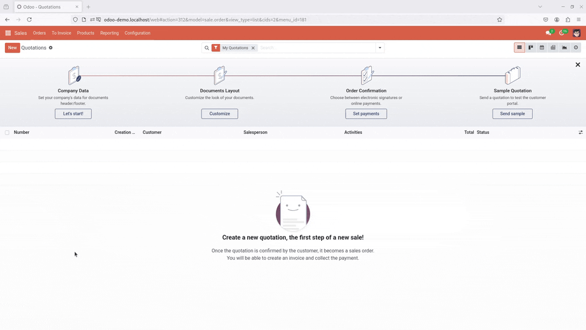

# Odoo Faker

**Odoo Faker** is an addon for **Odoo** that facilitates the generation of random demo data.

> [!WARNING]  
> First, take into account that this addon is still in development mode. But also, remember that the addon is not intended for production sites. Use it at your own discretion.

## Dependencies

This addon depends on Python's [Faker](https://faker.readthedocs.io) package for the generation of random data. Make sure to install it before enabling the addon.
