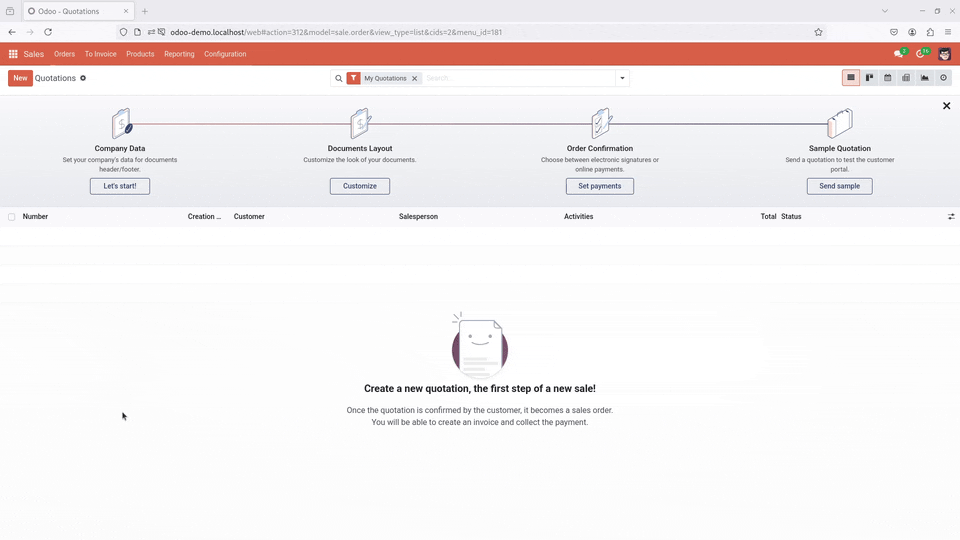
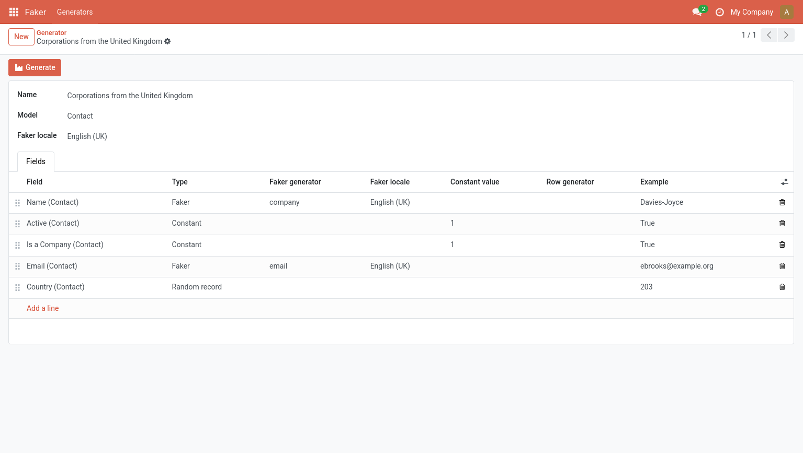
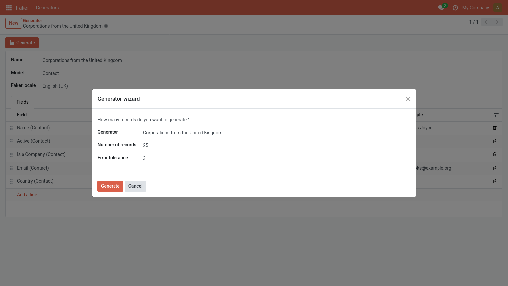

# Odoo Faker



**Odoo Faker** is an addon for **Odoo** that facilitates the generation of random demo data.

## Warning

> [!WARNING]
>
> First, take into account that this addon is still in development mode.
> Also, remember that the addon is not intended for production sites.
>
> Use it at your own discretion.

## Usage

### Generators

Once the addon is installed, you'll find a new **Faker** option in your menu. That option will let you define your own **Generators**.



Each of your generators will target a model from your Odoo database. You can create as many generators as you want. For every generator, you can define:

- a **name** (like _Corporations from the United Kingdom_)
- a **model** (like _Contact_)
- a default **locale** to be used when generating fake data

### Generator fields

To make your generators useful, you have to define its fields. The fields available are literally the stored fields of the corresponding model.

The information that you can set for each field depends on the type of field, which can be one of:

- **Constant**
- **Faker**
- **Random record**
- **Generated rows**

#### Constant

When adding fields of type **Constant** you will only be able to set one thing: its (constant) value.

You will use constant fields when you want all the generated records to have the same value.

> For instance, if you want to generate active contacts, you can set its _active_ field to _True_.

#### Faker

The **Faker** type is meant to be used for fields where you want a different value to be created each time, like names, emails, phones, addresses, account numbers, etc.

The values are generated by Python's [Faker](https://faker.readthedocs.io), so check out their documentation. Most of its methods are available. Feel free to open an issue if you need or want one of the methods that aren't currently available.

> By default, each new faker Field inherits the locale from its parent generator but you can choose a different one. Make the **Faker locale** column visible to be able to view and edit its value.

#### Random record

If your model has a many to one field (like the country of a contact) you can set its type **Random record** so one different record from the related table will be used each time.

#### Generated rows

If your model has a one to many relationship (like the lines of an order) you can set its type to **Generated rows** and use the **Row generator** column to select a related generator created specifically to define the child rows.

### Generator wizard

Once you have defined your generator, you can use the **Generate** header button to run a wizard where you can define:

- the **generator** that you want to use
- the **number of records** that you want to generate
- a maximum number of errors to tolerate before aborting



## Development

### Dependencies

This addon depends on Python's [Faker](https://faker.readthedocs.io) package for the generation of random data. Make sure to install it before enabling the addon.

### Tests

The test suite can be executed by filtering the tests with the **faker** tag.

```bash
odoo-bin --test-enable --test-tags faker
```
